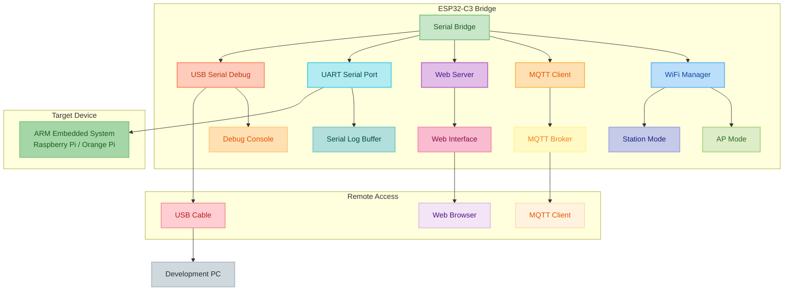
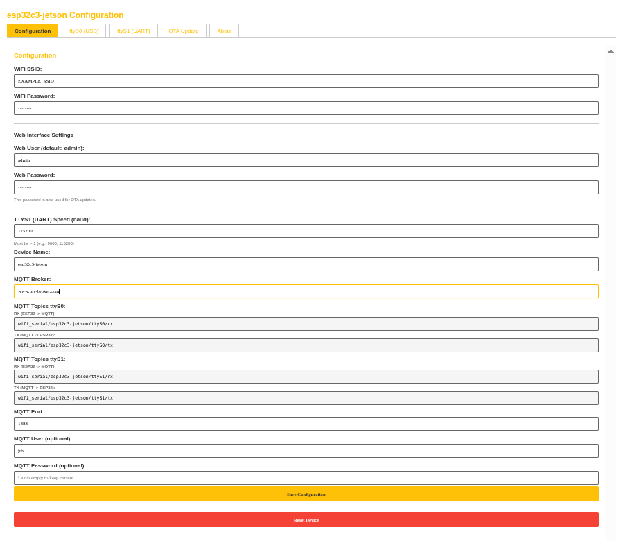

# ESP32 WiFi Serial Bridge

A lightweight WiFi-to-Serial bridge for small ARM-based embedded systems. Perfect for emergency access and remote administration of your homelab infrastructure when SSH isn't available.

## Purpose

This ESP32-based solution bridges serial console access over WiFi and MQTT, making it easy to integrate into deployments of small ARM servers and embedded devices. When your Raspberry Pi, Orange Pi, or other ARM-based systems lose network connectivity, this bridge provides a reliable fallback for console access and basic administration.

## Features

- **Serial Bridge**: Connect one ARM device via UART serial port
- **USB Debug Port**: Built-in USB serial for debugging and monitoring
- **MQTT Integration**: Send/receive serial data over MQTT topics
- **Web Interface**: Built-in web server for configuration and monitoring
- **AP Mode**: Automatic access point mode for initial setup
- **OTA Updates**: Over-the-air firmware updates
- **Serial Logging**: Circular buffer logging for serial port
- **Emergency Access**: Triple-press button reset for factory reset

## Architecture



## Use Cases

- **Emergency Console Access**: When SSH fails, access your ARM servers via serial console over WiFi
- **Remote Administration**: Manage headless embedded systems without physical access
- **Homelab Management**: Integrate into your homelab infrastructure for reliable out-of-band access
- **Development & Debugging**: Monitor serial output from multiple devices simultaneously

## Quick Start

1. Flash the firmware to your ESP32-C3 device using PlatformIO
2. On first boot, the device creates a WiFi access point (default IP: `192.168.4.1`)
3. Connect to the AP and navigate to `http://192.168.4.1` in your browser
4. Configure WiFi credentials and MQTT broker settings via the web interface
5. Connect your ARM devices to the serial ports (USB/UART)
6. Access serial consoles via MQTT topics or the web interface tabs

## Hardware Requirements

- ESP32-C3-DevKitM-1 (or compatible ESP32-C3 board)
- One ARM embedded device (Raspberry Pi, Orange Pi, etc.) connected via UART
- USB cable for debugging (built into ESP32-C3)
- WiFi network (or use AP mode)

## Pinout and Connections


### Required Pin Connections

The ESP32-C3-DevKitM-1 requires soldering headers to the following pins for this project:

**Serial Port 1 (UART) - Connect to ARM Device:**
- **GPIO 4** → RX (Receive from ARM device)
- **GPIO 5** → TX (Transmit to ARM device)
- **GND** → Ground (common ground with ARM device)

**Built-in Components (No soldering required):**
- **GPIO 8** → LED (built-in on board)
- **GPIO 9** → BOOT Button (built-in on board)

**Serial Port 0 (USB):**
- Uses native USB-C port (no external pins needed)
- Used for debugging and programming

### Connection Diagram

```
ESP32-C3-DevKitM-1          ARM Device (Raspberry Pi/Orange Pi)
──────────────────          ──────────────────────────────
GPIO 5 (TX) ───────────────> UART RX
GPIO 4 (RX) <─────────────── UART TX
GND         ──────────────── GND
```

**Note:** Ensure you connect TX to RX and RX to TX between the devices (crossed connection).

## Software Stack

- Platform: ESP32-C3 (Arduino framework)
- Communication: WiFi, MQTT (PubSubClient)
- Web: ESP32 WebServer
- Storage: Preferences (NVS)

## Web Interface

The device includes a built-in web server accessible at `http://192.168.4.1` (AP mode) or the device's IP address (station mode). The interface provides:

- **Configuration Tab**: WiFi credentials, MQTT broker settings, device name
- **Serial Console Tab**: Real-time serial output and input for the connected ARM device
- **Live Monitoring**: Automatic polling of serial logs with scrollable output
- **Remote Commands**: Send commands directly to connected devices via web interface

The interface uses a clean, minimalist design with yellow accents - functional without being overly polished, perfect for a fun homelab project.

### Web Interface Screenshot

The web interface provides a clean, functional design with yellow accents. The interface includes three tabs:
- **Configuration**: WiFi and MQTT settings form with topic displays
- **ttyS0**: Serial console for the connected ARM device (USB)
- **ttyS1**: Additional serial port (UART)



## Configuration

The device supports configuration via:
- Web interface (default: access point mode)
- Serial commands (Ctrl+Y prefix)
- Triple-press button reset

## License

This is a fun project for personal use. Use it, modify it, break it, fix it - just enjoy tinkering with your homelab! 🚀
